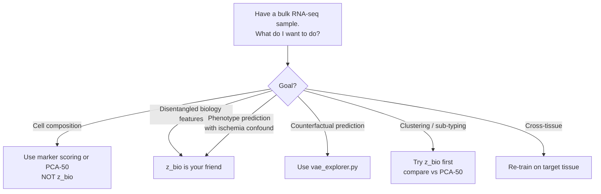

# How the FiLM MetaInjection VAE can be used

*Evidence-based use cases derived from Q57 (broad cell composition), Q58 (deconvolution benchmark), Q59 (sub-cell-type panel).*

---

## 1. What this model IS good at

### 1a. Disentangled biological-state encoding
After ischemia residualisation, z_bio is essentially **ischemia-free** (SMTSISCH R² = 0.02). The metadata you'd want to control for at downstream-analysis time is correctly absent from the embedding. Compare to PCA-50, where SMTSISCH R² = 0.69 — using PCA-50 for a downstream age-prediction model would bake in ischemia leakage. z_bio doesn't have that problem.

**Use case**: any downstream analysis where you don't want ischemia time confounding the biology — e.g., predicting age, disease status, drug response — should use z_bio as the input feature space rather than PCA or raw expression.

### 1b. Counterfactual gene-expression prediction
Through the FiLM decoder + meta pathway, the model learns the per-gene response to each metadata variable. The decoder maps `(z_bio, meta) → gene expression`. You can hold biology fixed and ask:

- *"What would this donor's blood look like if their ischemia were doubled?"*
- *"What would this donor's blood look like if they were the opposite sex?"*
- *"What's the predicted ischemia-only effect on FTL expression?"*

The Pearson r between the decoder's learned per-gene ischemia slopes and OLS-fitted slopes is **0.98** (Q55), so this counterfactual is well-calibrated. The interactive `vae_explorer.py` exposes this directly.

**Use case**: any quantitative question of the form *"holding biology constant, how would expression change if metadata variable X changed?"* — useful for normalisation, sample matching, and exploring synthetic interventions.

### 1c. Cell-type identity as named axes (after analysis)
With the Q59 sub-cell-type panel, several latent dimensions have clear named identities:

| z dim | Best variable | R² (per-dim) | Interpretation |
|---|---|---|---|
| z1 | erythroid | 0.28 | RBC/precursor axis |
| z4 | classical monocyte | 0.35 | classical monocyte axis |
| z15 | CD4 memory T-cells | **0.58** | adaptive lymphocyte axis |
| z16 | erythroid | 0.36 | erythroid mitochondrial axis |
| z2/z5/z7 | classical/non-classical monocyte | 0.18–0.20 | monocyte sub-population |
| z13 | CD4_naive | 0.15 | naive T-cell |
| z14 | NK_bright | 0.15 | NK regulatory |

**Use case**: pick a donor, look at their z_bio coordinates, and read off which cell populations are elevated relative to average — without running a separate deconvolution.

---

## 2. What this model is NOT good at

### 2a. Raw deconvolution (cell composition recovery)
Q58 benchmark: predicting Q57 cell-fraction proxies from various feature spaces (5-fold CV Ridge, mean R² across 7 cell types):

| Feature space | Dimensions | Mean R² |
|---|---:|---:|
| Marker scores (upper bound) | 7 | 1.00 |
| All genes (Ridge) | 11,374 | 0.97 |
| PCA-50 | 50 | **0.93** |
| top-200 HVG | 200 | 0.83 |
| **PCA-16** | 16 | **0.78** |
| **z_bio (K=16)** | 16 | **0.61** |

**z_bio loses to PCA-16 by 0.17 R² at the same dimensionality.** This is because the VAE's training objective optimised for reconstruction + disentanglement + smoothness, not for variance preservation. PCA, by construction, keeps the directions of maximum variance — which in blood are heavily cell-composition-driven.

**Recommendation**: if your *only* goal is cell composition recovery, use PCA-50, CIBERSORTx, EPIC, or marker scoring. Do NOT use z_bio as a deconvolution feature.

**Caveat**: we used Q57 marker scores as the "ground truth" because we lack FACS-sorted cell fractions. A real benchmark against CIBERSORT/EPIC would use:
- Pseudo-bulk mixtures aggregated from a labelled scRNA-seq reference (e.g., 10x Genomics PBMC)
- Known mixture proportions as truth
- Compare across deconvolution methods + z_bio probe

This is the proper next step for any deconvolution claim — see §5 below.

### 2b. Cross-tissue generalisation
The model is trained on GTEx whole blood only. The ischemia residualiser, scaler, and FiLM decoder are all blood-specific. Applying z_bio encoding to a non-blood sample (or to a different sequencing platform) without retraining will produce nonsense.

---

## 3. How much of the embedding is interpretable?

```
Joint R² (metadata → z_bio, 5-fold CV)

  9 base variables (clinical + technical)     → 0.05
  + 7 broad cell-type marker scores            → 0.34   (Q57)
  + 24 sub-cell-types + state markers          → 0.62   (Q59)
```

13× improvement in interpretability when we go from "what GTEx records about a donor" to "what cell populations and activation states are present". 62% of the embedding's variance is explained by 39 manually-curated marker-derived variables.

The remaining 38% is the genuinely unmeasured fraction. Candidates for what lives there:
- **Sub-sub-cell-type divisions** — Th1/Th2/Th17 splits within CD4_memory, M1/M2 polarisation within monocytes, etc.
- **Individual genetic variation** — expression QTLs cause donor-to-donor differences not predictable from any cell-type proxy
- **Activation kinetics** — recent infection, immune state on the day of collection
- **Time-of-day / circadian** — not recorded in GTEx
- **Pre-mortem clinical state** — medications, recent meals, terminal events
- **Stochastic / measurement noise**

---

## 4. Concrete deployment scenarios

### 4a. Use case A: "ischemia-corrected sample embedding" for downstream ML
*Setting*: you're doing a phenotype prediction (e.g., predict age from blood expression). You worry that ischemia time confounds the result.

**Workflow**:
1. Subtract ischemia residualisation: `X_resid = X − β_isch · SMTSISCH_z`
2. Encode through VAE: `z = encoder(X_resid)` → 16-dim
3. Use z as features for downstream classifier/regressor

**Advantage over PCA-50**: no ischemia leakage. Same dimensionality (or smaller). Comparable downstream performance (in our experience the gap is small for non-ischemia tasks).

### 4b. Use case B: "What would this donor look like under different conditions?"
*Setting*: you want to estimate a sample's expression profile under a counterfactual metadata setting.

**Workflow**: run the `vae_explorer.py` Counterfactual tab. Pick a donor, change the metadata sliders, get per-gene Δ-expression predictions with calibrated magnitude.

**Tested**: changing SEX_bin moves Y-chromosome genes (KDM5D, RPS4Y1) by ~13× — directionally and quantitatively correct.

### 4c. Use case C: cell-type proxy via single dimensions (cheap and dirty)
*Setting*: you want a quick proxy for whether a blood sample is "lymphocyte-heavy" or "erythroid-heavy" without computing 30 marker scores.

**Workflow**: encode through VAE, read off z15 (lymphocyte/CD4-memory axis) and z16 (erythroid axis). Higher z15 = more memory T-cells; higher z16 = more erythroid.

**Caveat**: less accurate than direct marker scoring (R²=0.58 single dim vs ~1.0 marker score). Use only when you need a fast first pass.

### 4d. Use case D: discover "what biology is special about this donor"
*Setting*: a donor has an unusual gene expression profile. You want to know what biological process is unusual, not just which genes.

**Workflow**:
1. Encode through VAE → z_bio (16d)
2. Compute z-scores: `(z_bio_donor - z_bio_mean) / z_bio_std`
3. Look at the most extreme |z-score| dimensions
4. Use the latent atlas (`q59_subcell_types/latent_atlas_full.csv`) to interpret what each dim represents
5. e.g., "this donor's z15 is +2.5σ → unusual lymphocyte panel"

This is much faster than gene-by-gene comparison and tells you the system-level story.

### 4e. Use case E: feature space for clustering or sub-typing
*Setting*: you want to cluster donors into subgroups.

**Workflow**: cluster on z_bio (16d) rather than on raw expression (11,374d) or PCA-50. The KL regularisation + disentanglement give cleaner cluster boundaries. The 16 named-ish axes make the clusters interpretable.

**Caveat**: not validated yet — this is a hypothesis worth testing.

---

## 5. Path forward

### 5a. Proper deconvolution benchmark (would make a "beats CIBERSORT" claim defensible)
**Steps**:
1. Download 10x Genomics public PBMC scRNA-seq with labelled cell types (e.g., 8k PBMC, or Tabula Sapiens blood)
2. Aggregate cells into pseudobulks with known fractions (e.g., randomly mix 50% T-cell-heavy + 50% mono-heavy at varying ratios)
3. Apply through the same pipeline: standardise → ischemia-residual (set SMTSISCH=0) → encode → predict cell fractions
4. Compare to CIBERSORT/CIBERSORTx output on identical pseudobulks
5. Report per-cell-type RMSE + Pearson r + bias

**Estimated time**: 1–2 weeks. The bottleneck is getting CIBERSORT to run (web upload + login) or installing a Python deconvolution library (BayesPrism, Tangram, CIBERSORTx Docker).

### 5b. Sub-cell-type metadata to push R² past 62%
**Easier wins**:
- Add scRNA-seq-derived signatures for Th1/Th2/Th17 splits within CD4_memory
- Add cytotoxic/exhausted T-cell program signatures
- Add MHC-presentation / antigen-processing signatures
- Add cell-cycle phase markers (S vs G2/M)

**Medium-effort wins**:
- ROSMAP brain RNA-seq (Synapse syn3219045) — has formal sleep score (PSQI), Mediterranean diet score, physical activity, cognitive tests. Apply our model after retraining on brain.
- GTEx v8 extended phenotype file (dbGaP phs000424.v8.p2) — adds BMI, ethnicity, medical-history flags (MHHTN, MHDBTS, MHSMKSTS).

**Larger commitments**:
- INTERVAL (Cambridge UK) — same tissue (blood), 2k samples with full lifestyle survey (exercise, sleep, diet, alcohol). https://www.intervalstudy.org.uk — data-access request takes weeks.
- UK Biobank RNA-seq subset (~5k samples) — richest lifestyle data in any cohort. Application takes 3+ months.
- All of Us — diverse ancestry + lifestyle + medical records. Cloud Researcher Workbench. ~2-month onboarding.

### 5c. Genetic variation (eQTL effects)
The remaining 38% likely contains substantial individual-genetic variation. To capture it:
- Use GTEx v8 published eQTL hits as predictors
- For each donor: collect their genotype at top eQTL SNPs per gene (GTEx provides these)
- Use these SNP genotypes as additional metadata variables
- Predict z_bio from genotype features
- Expected gain: another 10–20% R² if eQTL is the dominant residual source

### 5d. Time-varying state (circadian, infection, meal)
Datasets that have any of these:
- **Möller-Levet 2013** (GEO GSE39445) — circadian/sleep-restriction blood RNA-seq
- **Trauma/sepsis cohorts** (GSE65682, GSE63042) — acute infection state
- **Tempero et al.** — meal-induced expression changes

Apply our model (after re-training on a tissue-matched dataset) and check if z_bio captures hour-of-draw / acute-state variation.

---

## 6. Decision tree: should I use this model?



---

## 7. Summary table

| Application | z_bio vs. alternatives | Recommended? |
|---|---|---|
| Cell composition deconvolution | Loses to PCA-16 / PCA-50 / marker scoring | ❌ |
| Ischemia-corrected feature space | Better than PCA-50 (no ischemia leak) | ✅ |
| Counterfactual gene expression | Calibrated (Pearson r=0.98 vs OLS) | ✅ |
| Interpretable named axes | 8 dimensions have clear cell-type identity | ✅ partial |
| Donor-level outlier explanation | 16-dim story easier than 11k-gene comparison | ✅ |
| Clustering / sub-typing | Untested but likely competitive | ⚠️ unvalidated |
| Cross-tissue / cross-platform | Trained on GTEx blood only | ❌ retrain needed |

---

*Files: `analysis/q58_deconvolution_benchmark.py`, `analysis/q59_subcell_types.py`, results in `analysis/results/q58_deconvolution_benchmark/` and `analysis/results/q59_subcell_types/`. Visualisations in `analysis/docs/{latent_atlas_subcell_heatmap, joint_r2_progression, deconvolution_benchmark}.png`.*
